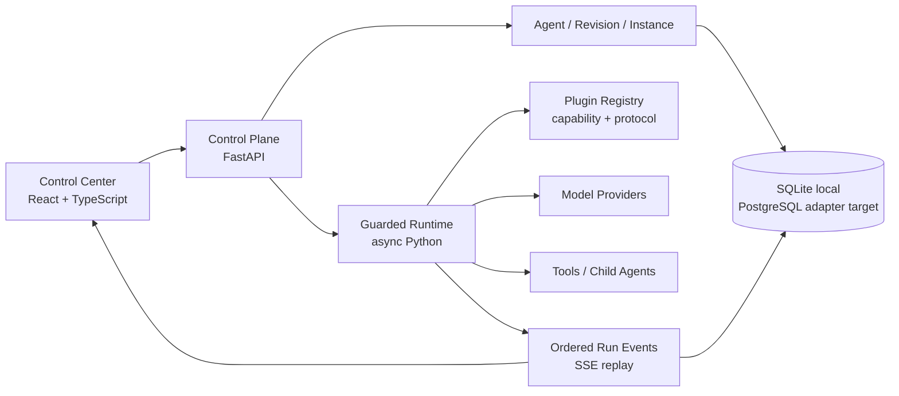

# UAI Forge

UAI Forge 是一个以扩展契约为中心的 Python Agent 框架和多 Agent 控制面。
它把 Agent 定义、不可变修订、运行实例、子 Agent 挂载、执行预算和事件流分开，
使同一套领域逻辑可在本地单进程运行，并提供面向容器化单节点云试运行的制品与清单。
当前环境字段只是运行上下文标签，不会自动创建容器或云资源。

当前版本是可运行的 `0.1.0` 基线，包含：

- Python 3.9+ 异步 Agent 运行时与 FastAPI 控制 API。
- Agent 配置修订、乐观并发控制与多个运行实例。
- 实例级策略 override 使用显式 allowlist，只能收紧固定 revision 的执行上限。
- Agent-as-tool 子 Agent 挂载、静态环检测和动态调用路径保护。
- 共享 step / tool / token 预算、深度、超时与双层并发闸门。
- Provider、Tool、Memory、Middleware、Storage、Event Bus、Scheduler、UI
  八类扩展清单和 PyPA entry-point 发现。
- 核心只依赖自有 Repository/Event Port；SQLite 与进程内 EventBroker 是可替换的内置适配器。
- OpenAI-compatible 与确定性离线模型适配器。
- SQLite 持久化、按 Run 单调排序的事件和可重连 SSE。
- React/TypeScript 管理后台：可发布 Agent 修订，配置模型、工具权限、记忆、中间件、
  子 Agent 固定修订/并发/输入模板，管理多个实例，并查看真实运行事件。
- Docker、本地命令、Kubernetes 单副本示例、CI、规格、ADR、威胁模型与需求追踪。

## 架构



内核不依赖 AgentScope、LangGraph、AutoGen 等第三方领域类型。MCP、A2A、AG-UI
和特定存储/消息系统被视为边缘适配器；这样可在参考开源理念的同时保持替换能力。

## 本地运行

要求：Python 3.9+、Node.js 22.13+。

```bash
python3 -m venv .venv
.venv/bin/python -m pip install --upgrade pip setuptools wheel
.venv/bin/python -m pip install -e 'backend[dev]'
npm install
```

启动 Python 控制面：

```bash
.venv/bin/uai-forge serve --host 127.0.0.1 --port 8000
```

另开一个终端启动后台：

```bash
npm run dev
```

打开 `http://localhost:3000`。页面会自动连接
`http://localhost:8000/api/v1`；如果控制面不在线，会明确进入演示模式。

离线模型可以直接验证多 Agent 委派：

```text
delegate:analyst 评估当前框架的扩展边界
```

## Docker

```bash
docker compose up --build
```

后台位于 `http://localhost:3000`，API 文档位于
`http://localhost:8000/docs`。SQLite 数据保存在命名卷中。

## 测试

```bash
.venv/bin/python -m pytest backend/tests -q
npm run lint
npm run typecheck
npm test
```

2026-07-30 合并基线在 Python 3.9.6 上为后端 `65 passed`；前端 lint、typecheck、
production build 与 3 项 SSR/source 合同测试全部通过。真实浏览器委派 Run 产生
17 条连续持久事件，并可通过 SSE `Last-Event-ID` 续播终态。

测试覆盖版本冲突、跨租户数据隔离、挂载环、子 Agent 委派、共享预算、
实例策略收紧、mount 权限交集、插件配置与工具参数 Schema、记忆启停、密钥输入拒绝、
非 SQLite/EventBroker 端口替身、安全计算器、API CRUD/运行生命周期、SSE 竞态、
真实事件 history 和服务端渲染。

## 配置

| 环境变量 | 默认值 | 说明 |
|---|---|---|
| `UAI_FORGE_DATABASE_PATH` | `.uai-forge/forge.db` | SQLite 文件路径 |
| `UAI_FORGE_CONTROL_API_KEY` | 空 | 设置后所有 `/api/v1` 请求必须携带密钥 |
| `UAI_FORGE_ALLOWED_ORIGINS` | 本地后台地址 | 逗号分隔 CORS 来源 |
| `UAI_FORGE_SEED_DEMO` | `true` | 空数据库是否写入研究团队示例 |
| `UAI_FORGE_HOST` | `0.0.0.0` | API 监听地址 |
| `UAI_FORGE_PORT` | `8000` | API 端口 |

模型密钥只通过环境变量引用。Agent 配置保存 `api_key_env`，不保存明文。

## 扩展

第三方 Python 包在 `pyproject.toml` 中声明：

```toml
[project.entry-points."uai_forge.plugins"]
my_bundle = "my_package.plugin:plugin"
```

导出对象实现 `register(registry)`，并注册带有 `protocol_version`、能力清单和配置
JSON Schema 的 manifest。核心协议主版本不兼容时会拒绝加载；配置 Schema 会在绑定和
运行边界进行 fail-closed 校验。单个扩展发现失败不会阻止控制面启动，但会进入诊断列表。

详见：

- [开源框架调研](docs/research/agent-framework-landscape-2026-07-30.md)
- [产品需求](docs/product/PRD.md)
- [架构设计](docs/architecture/overview.md)
- [Spec 驱动方法](docs/governance/spec-driven-development.md)
- [当前能力规范](specs/current/foundation/spec.md)
- [威胁模型](docs/security/threat-model.md)

## 当前边界

`0.1.0` 是单进程可运行基线，不把以下能力伪装为已经完成：

- 跨进程持久化 checkpoint、outbox 和崩溃后自动续跑。
- OIDC/RBAC、密钥托管和数据库级租户隔离。
- 任意第三方插件的进程/容器沙箱。
- PostgreSQL/Redis/NATS 正式适配器、远程 A2A 与完整 MCP gateway。
- 人工审批后恢复、计划任务和长期记忆。

这些能力已经进入规范、ADR、威胁模型和路线图，接口边界在当前实现中预留。

## License

Apache-2.0，见 [LICENSE](LICENSE)。
