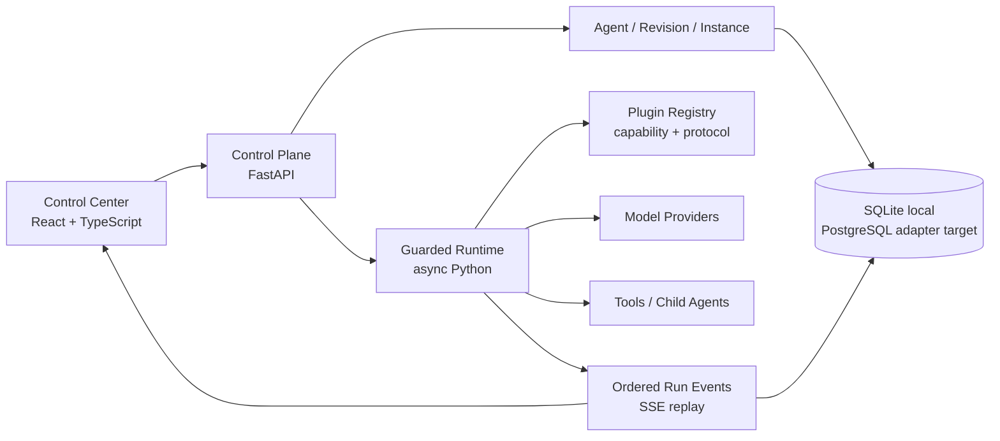

# UAI Forge

UAI Forge 是一个以扩展契约为中心的 Python Agent 框架和多 Agent 控制面。
它把 Agent 定义、不可变修订、运行实例、子 Agent 挂载、执行预算和事件流分开，
使同一套领域逻辑可在本地单进程运行，并提供经过可重复 smoke 验证的单节点容器制品。
当前环境字段只是运行上下文标签，不会自动创建容器或云资源。

当前版本是可运行的 `0.1.0` 单进程基线，包含：

- Python 3.9+ 异步 Agent 运行时与 FastAPI 控制 API。
- Agent 配置修订、乐观并发控制与多个运行实例。
- 实例级策略 override 使用显式 allowlist，只能收紧固定 revision 的执行上限。
- Agent-as-tool 子 Agent 挂载、静态环检测和动态调用路径保护。
- 共享 step / tool / token 预算、深度、超时与双层并发闸门。
- Provider、Tool、Memory、Middleware、Storage、Event Bus、Scheduler、UI
  八类扩展清单和 PyPA entry-point 发现。
- 核心只依赖自有 Repository/Event Port；SQLite 与进程内 EventBroker 是可替换的内置适配器。
- OpenAI-compatible Chat Completions 与 Anthropic Messages 模型适配器；没有内置演示或伪造模型。
- SQLite 持久化、按 Run 单调排序的事件和可重连 SSE。
- 租户级统一 `ModelConfig`（provider、protocol、model、endpoint 与加密凭证）；支持草稿、连接检查、版本/CAS、启用/停用和显式 Secret `keep|replace|clear`，控制台仅展示脱敏信息。
- 支持多个独立 ModelConfig/AK；选择厂商或已知服务地址会自动带出对应推荐模型，自定义地址保留当前模型。
- SetupStatus、CapabilityStatus、Agent Readiness、Problem Details 与 schema compatibility doctor，帮助空库沿真实前置条件完成首个任务。
- React/TypeScript 管理后台：可发布 Agent 修订，配置模型、工具权限、记忆、中间件、
  子 Agent 固定修订/并发/输入模板，管理多个实例，并查看真实运行事件。
- Docker、本地命令、Kubernetes 单副本示例、规格、ADR、威胁模型与需求追踪。

## 架构



内核不依赖 AgentScope、LangGraph、AutoGen 等第三方领域类型。MCP、A2A、AG-UI
和特定存储/消息系统被视为边缘适配器；这样可在参考开源理念的同时保持替换能力。

## 本地运行

要求：Python 3.9+、Node.js 22.13+。

```bash
python3 -m venv .venv
.venv/bin/python -m pip install --upgrade pip setuptools wheel
.venv/bin/python -m pip install -e 'backend[dev]'
npm install
```

启动 Python 控制面：

```bash
.venv/bin/uai-forge serve --host 127.0.0.1 --port 8000
```

另开一个终端启动后台：

```bash
npm run dev
```

打开 `http://localhost:3000`。页面会自动连接
`http://localhost:8000/api/v1`；如果控制面不在线，会明确显示未连接空状态，不生成本地业务数据。

业务配置全部由控制面数据库提供。首次接入真实模型时，请在“凭证&模型配置”侧边栏创建
一条统一连接，再在 Agent 编辑器选择 `model_config_id`；AK 不会写入 Agent JSON、浏览器
持久化或事件。内置协议包括 OpenAI-compatible Chat Completions 和 Anthropic Claude
Messages；DeepSeek、通义千问、Kimi、智谱、豆包、混元、MiniMax、百川、零一万物、阶跃
星辰等常见国内模型均可从目录选择，也可以填写自定义模型 ID。
本地/云端部署都应注入高熵 `UAI_FORGE_CREDENTIAL_MASTER_KEY`（由 Secret Manager 提供），
不要依赖仅用于开发测试的默认 master key。

首次运行不会写入示例 Agent 或运行记录；请先在“凭证&模型配置”创建数据库模型连接，再
通过后台创建 Agent 和 Instance。真实模型调用只会使用已启用且已配置凭证的连接。

## Docker

```bash
docker compose up --build
```

后台位于 `http://localhost:3000`，API 文档位于
`http://localhost:8000/docs`。SQLite 数据保存在命名卷
`uai-forge-data-v2` 中；该版本化名称用于避开 ADR-0007 之前的 legacy 配置卷，旧卷不会被
静默迁移。默认只绑定
`127.0.0.1`；需要远程访问时，必须先配置控制密钥、可信 CORS/TLS，再显式把
`UAI_FORGE_BIND_ADDRESS` 设为所需接口。

如果 Docker/Colima 没有把宿主机 DNS 转发给容器，Compose 会使用 `1.1.1.1` 作为后端
解析器；可用 `UAI_FORGE_DNS_SERVER` 覆盖。需要选择其他已备份的数据卷时，设置
`UAI_FORGE_DATA_VOLUME` 后再启动；不要删除旧卷来绕过兼容性门禁。

完整的隔离容器验收会构建镜像、等待健康、运行 doctor、核对全新的数据库与 provider
注册表，并清理本次测试资源：

```bash
make container-smoke
```

只运行与平台无关的代码、合同和 Compose 配置门禁：

```bash
make verify
```

## 测试

```bash
.venv/bin/python -m pytest backend/tests -q
npm audit --omit=dev --audit-level=high
npm run lint
npm run typecheck
npm test
make verify
make container-smoke
```

2026-08-01 当前工作树的验证结果以 `artifacts/evidence-summary.json` 为准；最近一次后端
门禁为 `113 passed`，前端 lint、typecheck、production build 与 SSR/source 合同测试全部通过。
单节点 Compose smoke 还验证了双镜像
构建、双容器健康、容器内 doctor、空数据库、生产 provider 注册和 Web 运行镜像的开发
工具裁剪与 production-only audit。完整开发工具链 audit 会
单独审查，不能用未经验证的破坏性主版本升级静默消除。

测试覆盖版本冲突、跨租户数据隔离、挂载环、子 Agent 委派、共享预算、
实例策略收紧、mount 权限交集、插件配置与工具参数 Schema、记忆启停、密钥输入拒绝、
非 SQLite/EventBroker 端口替身、安全计算器、API CRUD/运行生命周期、SSE 竞态、
真实事件 history 和服务端渲染。

## 配置

| 环境变量 | 默认值 | 说明 |
|---|---|---|
| `UAI_FORGE_DATABASE_PATH` | `.uai-forge/forge.db` | SQLite 文件路径 |
| `UAI_FORGE_CONTROL_API_KEY` | 空 | 设置后所有 `/api/v1` 请求必须携带密钥 |
| `UAI_FORGE_CREDENTIAL_MASTER_KEY` | 空（仅开发回退） | 数据库凭据加密主密钥；部署必须由 Secret Manager 注入 |
| `UAI_FORGE_ALLOWED_ORIGINS` | 本地后台地址 | 逗号分隔 CORS 来源 |
| `UAI_FORGE_HOST` | `0.0.0.0` | API 监听地址 |
| `UAI_FORGE_PORT` | `8000` | API 端口 |
| `UAI_FORGE_BIND_ADDRESS` | `127.0.0.1` | Compose 发布到宿主机的绑定地址；远程暴露前先配置密钥/CORS/TLS |
| `UAI_FORGE_DATA_VOLUME` | `uai-forge-data-v2` | Compose SQLite 命名卷；旧 schema 卷不会自动迁移 |
| `UAI_FORGE_DNS_SERVER` | `1.1.1.1` | Compose 后端容器的 DNS；按本地网络策略覆盖 |
| `UAI_FORGE_WEB_HOST` | `0.0.0.0` | production Web 监听地址 |
| `PORT` | `3000` | production Web 容器内端口 |

模型 AK 通过“凭证&模型配置”写入数据库 `ModelConfig` 的密文列；Agent 只引用
`model_config_id`，API 只返回脱敏 mask，运行时短暂解密。凭证型 Provider 默认先保存为
`draft`，必须完成不含 prompt 的连接检查后才能启用；OpenAI-compatible 和 Claude
provider 没有数据库凭据时都会 fail closed。更新使用 `expected_version`，Secret 变更必须
明确选择 `keep`、`replace` 或 `clear`。
不要把 AK 写入 Agent 配置、环境文件、浏览器持久化或版本库。

控制台的 `/api/v1/setup-status`、`/api/v1/capabilities` 和
`/api/v1/agents/{id}/readiness` 都是服务端计算视图，不是第二套业务事实源。Active Run
以 `/api/v1/runs/{id}/events` 的持久 `sequence` 为 SSE 游标；断线从最后确认位置续播，
轮询只作为有界降级并标记 degraded。当前仍是单进程事件流，不代表分布式恢复。

OpenAI Sites 的 `.openai/hosting.json` 同样只保存在部署者本机；公开源码提供
`.openai/hosting.example.json`，干净 checkout 没有真实 hosting 文件也可直接构建。

## 扩展

第三方 Python 包在 `pyproject.toml` 中声明：

```toml
[project.entry-points."uai_forge.plugins"]
my_bundle = "my_package.plugin:plugin"
```

导出对象实现 `register(registry)`，并注册带有 `protocol_version`、能力清单和配置
JSON Schema 的 manifest。核心协议主版本不兼容时会拒绝加载；配置 Schema 会在绑定和
运行边界进行 fail-closed 校验。单个扩展发现失败不会阻止控制面启动，但会进入诊断列表。

详见：

- [开源框架调研](docs/research/agent-framework-landscape-2026-07-30.md)
- [产品需求](docs/product/PRD.md)
- [架构设计](docs/architecture/overview.md)
- [Spec 驱动方法](docs/governance/spec-driven-development.md)
- [当前能力规范](specs/current/foundation/spec.md)
- [威胁模型](docs/security/threat-model.md)

## 当前边界

`0.1.0` 是单进程可运行基线，不把以下能力伪装为已经完成：

- 跨进程持久化 checkpoint、outbox 和崩溃后自动续跑。
- OIDC/RBAC、密钥托管和数据库级租户隔离。
- 任意第三方插件的进程/容器沙箱。
- PostgreSQL/Redis/NATS 正式适配器、远程 A2A 与完整 MCP gateway。
- 人工审批后恢复、计划任务和长期记忆。

这些能力已经进入规范、ADR、威胁模型和路线图，接口边界在当前实现中预留。

## License

Apache-2.0，见 [LICENSE](LICENSE)。
