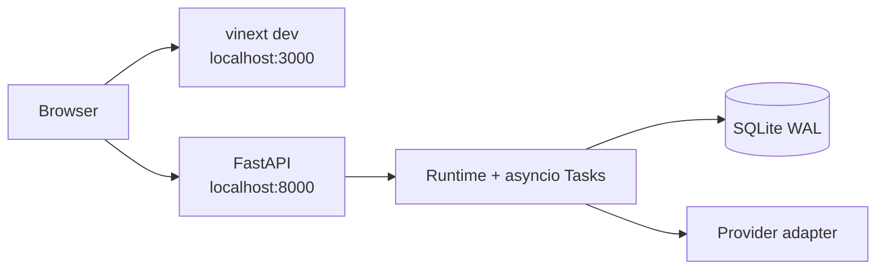
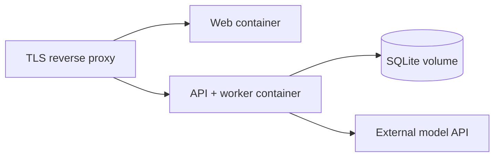
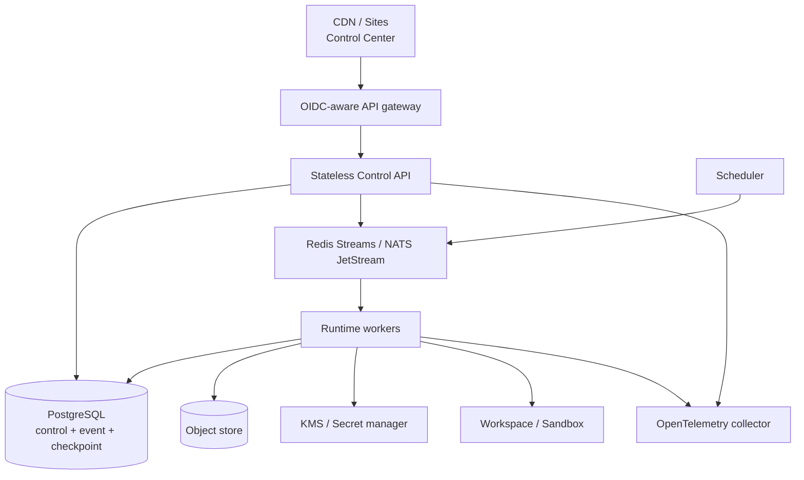

# 部署设计

## 部署原则

- 本地与云端复用同一领域合同和 API；差异放在 Storage、Bus、Scheduler、Workspace、
  Credential 和 Tracing 适配器。
- Web 控制台和 Python Control API 是两个独立部署单元。静态/边缘托管的 Web 页面不会
  自动获得访问用户电脑 `localhost:8000` 的能力。
- 单进程部署只声称单进程语义；未经过 lease、checkpoint 和故障测试前不横向扩 worker。
- 配置与 Secret 分离。部署清单只保存环境变量名或 SecretRef，不保存值。

## 模式 A：本地开发（`0.1.0 Implemented`）



特征：

- Web 通过可配置的 API base URL 访问 FastAPI。
- 未连接时页面明确显示未连接状态；页面不生成 Agent、模型、凭据或运行事件数据。
- SQLite 保存定义、草稿/发布修订、Run 和 Run Event；运行实例不是独立资源。
- 启动先执行 schema compatibility gate：当前 SQLite schema version 为 `3`，必须包含 Agent
  lifecycle 的 `status`/`published_at` 字段；旧 schema、旧 Instance 表、旧 `instance_id`
  运行目标列和 `CredentialProfile`/`ModelProfile` legacy 表会在业务读写前 fail closed。
  `uai-forge doctor` 输出只读兼容状态以及 backup/rebuild remediation，不执行迁移。
- Memory、Task、并发锁和 live fan-out 仍在 Python 进程内。
- API key 为空时控制 API 无认证；设置后也只是单一共享控制密钥。

控制台连接配置统一使用租户级 `ModelConfig`。凭证型连接先保存为 `draft`，连接检查只返回
稳定 code、时间、延迟和脱敏 endpoint/provider/model 摘要；启用和修改分别受验证结果与
`expected_version` CAS 保护，Secret 变更必须显式使用 `keep|replace|clear`。这些能力改善
单进程控制面的可操作性，不构成 OIDC/RBAC、可信 tenant identity 或 Secret Manager。

`/api/v1/setup-status`、`/api/v1/capabilities` 和 Agent readiness 是计算视图。Active Run
通过 `/api/v1/runs/{id}/events` 按持久 sequence 续播；断线时前端从最后确认 sequence 重连，
有限轮询只作为标记为 degraded 的降级路径。

本地可重复验证命令：

```bash
.venv/bin/uai-forge serve --host 127.0.0.1 --port 8000
npm run dev
```

## 模式 B：单节点容器（`0.1.0 Implemented`）



该模式可用于单节点云试运行，不等于分布式：

- API 和 worker 必须保持单副本，或使用同一进程。
- Compose host port 默认只绑定 `127.0.0.1`；远程暴露前必须配置控制密钥、可信
  CORS/TLS，并显式设置 `UAI_FORGE_BIND_ADDRESS`。
- SQLite 使用单写节点和持久卷；不能放在多写共享文件系统上。
- 终止前需要停止接收 Run、等待短任务或明确取消。
- 重启前处于 `running` 的记录目前不能自动续跑，应被运维检查并标记失败。
- readiness 必须验证数据库可写和内置插件注册；liveness 只检查进程响应。

如果启用 `tool.sandbox_exec`，不要把 rootful `/var/run/docker.sock` 挂进含不可信 Agent
工具的 API 容器。应使用 rootless/dedicated Docker daemon 或独立 sandbox executor，按
镜像 allowlist/digest、宿主 egress、runtime profile 和租户配额部署；控制面只提交自有
`SandboxRequest`，不接收 Docker flags、宿主挂载或环境变量。

`scripts/container-smoke.sh` 是可重复门禁：它以唯一 Compose project、动态 loopback
端口和 volume 构建并启动两个生产镜像，等待 Web/API 健康，运行容器内 doctor，再通过
HTTP API 验证空数据库与完整生产 provider 注册表（`anthropic_messages`、
`openai_compatible`），验证 Web 运行镜像只保留 production graph，
镜像构建阶段对裁剪后的 graph 重复 production audit，最后断言本次容器、network 和
volume 均已清理。需要验证真实模型调用时，应先在数据库配置凭据和模型档，再单独执行
带有真实外部 provider 的 API smoke。

## 模式 C：可恢复云部署（`Specified` / `Planned`）



进入该模式前必须具备：

1. Repository、CheckpointStore、OutboxStore、MessageBus 和 LeaseStore 自有 Protocol。
2. PostgreSQL 迁移、行级并发测试和租户索引。
3. durable queue、消费者重投和 dead-letter 策略。
4. Run/Invocation checkpoint、幂等副作用、lease/fencing 和崩溃恢复测试。
5. OIDC 身份绑定 tenant，RBAC/ABAC 和审计。
6. Secret manager、轮换和日志/事件脱敏。
7. 至少一次 worker kill、网络分区、重复投递和 schema migration 演练。

Redis/NATS 只能传递引用和小型事件；大 payload 放入对象存储并使用带租户和完整性校验的
引用。数据库仍是控制状态和 outbox 的事实源。

## Web 托管边界

`.openai/hosting.json` 是部署者本机的 Sites 项目标识与 binding 配置，必须由 Git 和
Docker build context 忽略；公开源码只提供不含 `project_id` 的
`.openai/hosting.example.json`。普通 checkout 在真实文件不存在时按无 D1/R2 binding
构建。该本地文件存在也不证明已部署；只有持久化的 `project_id`、保存的版本和成功的
部署状态才构成 Sites 发布证据。

Sites 可托管控制后台，但 Python Runtime 必须部署到可由浏览器访问的 HTTPS API：

- API base URL 由部署环境注入或由管理员配置。
- CORS 只允许实际控制台来源。
- 生产环境禁止默认为 `localhost` 后静默工作。
- 浏览器中的 API key 不持久化；生产应改用短时会话令牌。
- UI 健康和 API 健康分开报告。

## 配置分层

优先级从低到高：

1. 版本化默认值。
2. 部署环境配置。
3. 数据库中的租户 RuntimeConfig 和统一 ModelConfig。
4. 单次 Run 的非敏感参数。
5. 单次 Run 非敏感参数。

ModelConfig secret 不参与普通覆盖合并，只在 provider 适配器边界短暂解析。Run 只能选择
不可变 Agent revision；未指定时在提交时解析 Agent 的 latest 标签。latest 是可回滚的
指针，不等同于最大 revision。正式 deployment profile、容量和
desired/observed controller 属于后续版本。

## 数据与 schema 边界

- 当前 SQLite 使用 `schema_meta(component="sqlite", version=3, updated_at)` 作为兼容门。
  只有新建数据库和完整当前 schema 会启动；旧 schema、旧 Instance/`instance_id` 结构和
  缺失 Agent lifecycle 字段必须先备份再重建，不做静默迁移或旧语义猜测。
- 后续破坏性 schema 变化仍需增加新的显式 change package、备份提示和恢复验证；本基线不
  提供向前兼容窗口，也不原地重写 Agent Revision 和 Event 审计记录。
- 插件状态使用 `plugin_id / state_schema_version` 命名空间，迁移失败时插件 fail closed。
- 每次部署记录 core、协议、插件和 schema 版本组合。

## 可观测与运维

`0.1.0` 有 Run Event 和预算 metrics，但没有完整 OpenTelemetry。

云部署必须输出：

- HTTP、Run、Invocation、模型、工具和 peer message span。
- queue lag、lease expiry、retry、outbox backlog、checkpoint age。
- 每租户配额和拒绝计数，不输出 prompt、Secret 或原始 chain-of-thought。
- correlation ID 与 Run/Event ID，可从告警定位到经过脱敏的审计事件。

## 发布门禁

- [ ] 当前部署模式与副本数声明准确。
- [ ] 后端、前端、合同和迁移测试通过。
- [ ] Secret 扫描和生产配置审查通过。
- [ ] CORS、TLS、身份与 tenant 绑定已验证。
- [ ] 已配置真实 provider 的 API smoke test；容器 smoke 不创建或伪造业务数据。
- [ ] Run 取消和进程终止行为已验证。
- [ ] 数据备份与恢复演练完成。
- [ ] 若多 worker：重复投递、lease 过期和 worker kill 测试完成。

### `0.1.x` 单节点容器证据

- [x] 部署模式固定为单后端 worker、单 Web 副本与单写 SQLite volume。
- [x] 两个生产镜像构建并启动成功。
- [x] 两个容器健康，后端 doctor 无插件错误。
- [x] Web 运行镜像裁剪开发工具并通过镜像内 production audit。
- [x] 新数据库只暴露生产 `anthropic_messages` 与 `openai_compatible` provider，且不自动写入
  Agent、凭据、ModelConfig 或运行记录。
- [x] smoke 使用唯一 project/volume/image tag 和动态 loopback 端口，并验证容器、
  network、volume 与临时 image tag 清理。

这些勾选只证明本地/单节点容器语义。公网 TLS、可信身份、CORS 生产来源、备份恢复和
多 worker 故障测试仍属于具体云环境或后续版本的发布门。
