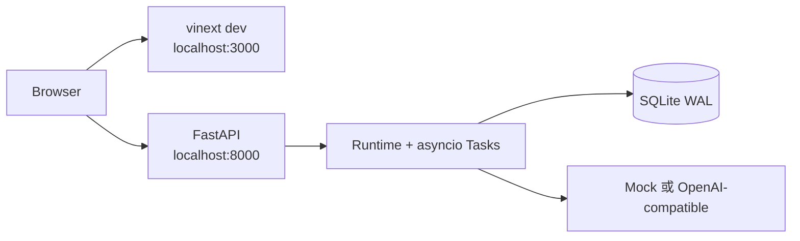
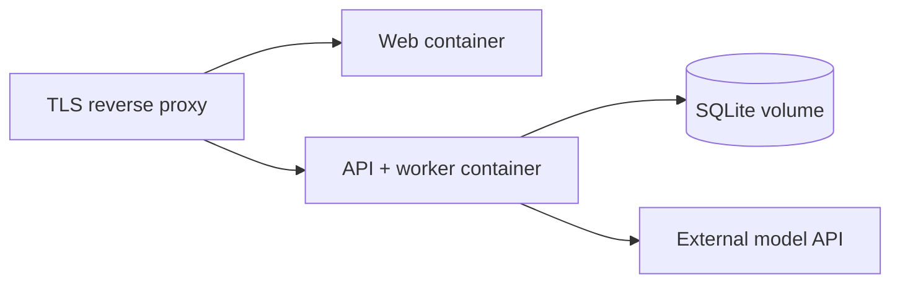
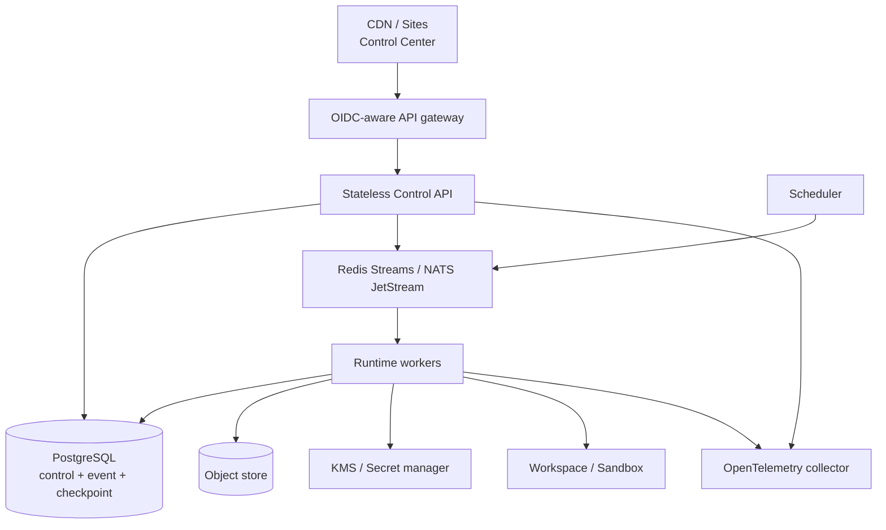

# 部署设计

## 部署原则

- 本地与云端复用同一领域合同和 API；差异放在 Storage、Bus、Scheduler、Workspace、
  Credential 和 Tracing 适配器。
- Web 控制台和 Python Control API 是两个独立部署单元。静态/边缘托管的 Web 页面不会
  自动获得访问用户电脑 `localhost:8000` 的能力。
- 单进程部署只声称单进程语义；未经过 lease、checkpoint 和故障测试前不横向扩 worker。
- 配置与 Secret 分离。部署清单只保存环境变量名或 SecretRef，不保存值。

## 模式 A：本地开发（`0.1.0 Implemented`）



特征：

- Web 通过可配置的 API base URL 访问 FastAPI。
- 未连接时页面明确显示 demo mode；演示数据不能作为后端健康证据。
- SQLite 保存定义、修订、实例、Run 和 Run Event。
- Memory、Task、并发锁和 live fan-out 仍在 Python 进程内。
- API key 为空时控制 API 无认证；设置后也只是单一共享控制密钥。

本地可重复验证命令：

```bash
.venv/bin/uai-forge serve --host 127.0.0.1 --port 8000
npm run dev
```

## 模式 B：单节点容器（`Specified`）



该模式是云端试运行目标，不等于分布式：

- API 和 worker 必须保持单副本，或使用同一进程。
- SQLite 使用单写节点和持久卷；不能放在多写共享文件系统上。
- 终止前需要停止接收 Run、等待短任务或明确取消。
- 重启前处于 `running` 的记录目前不能自动续跑，应被运维检查并标记失败。
- readiness 必须验证数据库可写和内置插件注册；liveness 只检查进程响应。

只有容器构建、启动、健康检查和真实委派 smoke test 全部通过后，部署清单才能标记
`Implemented`。

## 模式 C：可恢复云部署（`Specified` / `Planned`）



进入该模式前必须具备：

1. Repository、CheckpointStore、OutboxStore、MessageBus 和 LeaseStore 自有 Protocol。
2. PostgreSQL 迁移、行级并发测试和租户索引。
3. durable queue、消费者重投和 dead-letter 策略。
4. Run/Invocation checkpoint、幂等副作用、lease/fencing 和崩溃恢复测试。
5. OIDC 身份绑定 tenant，RBAC/ABAC 和审计。
6. Secret manager、轮换和日志/事件脱敏。
7. 至少一次 worker kill、网络分区、重复投递和 schema migration 演练。

Redis/NATS 只能传递引用和小型事件；大 payload 放入对象存储并使用带租户和完整性校验的
引用。数据库仍是控制状态和 outbox 的事实源。

## Web 托管边界

`.openai/hosting.json` 存在并不证明已部署。只有持久化的 `project_id`、保存的版本和
成功的部署状态才构成 Sites 发布证据。

Sites 可托管控制后台，但 Python Runtime 必须部署到可由浏览器访问的 HTTPS API：

- API base URL 由部署环境注入或由管理员配置。
- CORS 只允许实际控制台来源。
- 生产环境禁止默认为 `localhost` 后静默工作。
- 浏览器中的 API key 不持久化；生产应改用短时会话令牌。
- UI 健康和 API 健康分开报告。

## 配置分层

优先级从低到高：

1. 版本化默认值。
2. 部署环境配置。
3. Agent Instance 允许范围内的覆盖。
4. 单次 Run 非敏感参数。

SecretRef 不参与普通覆盖合并。Instance override 必须经过显式 Schema 和 allowlist；
`0.1.x` 当前只允许收紧 execution policy，并为本次 Run 构造不写回 revision 的 effective
spec。provider/tool/plugin 配置覆盖、正式 deployment profile 和 Instance capacity 热更新
仍未完成，因此 `CORE-003` 保持 `Partial`。

## 数据与迁移

- SQLite 初始化目前使用幂等 `CREATE TABLE IF NOT EXISTS`，适合 `0.1.0`，不等于正式迁移。
- 引入破坏性 schema 变化前建立递增迁移版本、备份、向前兼容窗口和回滚验证。
- Agent Revision 和 Event 是审计记录，迁移不得原地重写业务语义。
- 插件状态使用 `plugin_id / state_schema_version` 命名空间，迁移失败时插件 fail closed。
- 每次部署记录 core、协议、插件和 schema 版本组合。

## 可观测与运维

`0.1.0` 有 Run Event 和预算 metrics，但没有完整 OpenTelemetry。

云部署必须输出：

- HTTP、Run、Invocation、模型、工具和 peer message span。
- queue lag、lease expiry、retry、outbox backlog、checkpoint age。
- 每租户配额和拒绝计数，不输出 prompt、Secret 或原始 chain-of-thought。
- correlation ID 与 Run/Event ID，可从告警定位到经过脱敏的审计事件。

## 发布门禁

- [ ] 当前部署模式与副本数声明准确。
- [ ] 后端、前端、合同和迁移测试通过。
- [ ] Secret 扫描和生产配置审查通过。
- [ ] CORS、TLS、身份与 tenant 绑定已验证。
- [ ] 真实 API smoke test，不依赖 demo 数据。
- [ ] Run 取消和进程终止行为已验证。
- [ ] 数据备份与恢复演练完成。
- [ ] 若多 worker：重复投递、lease 过期和 worker kill 测试完成。
