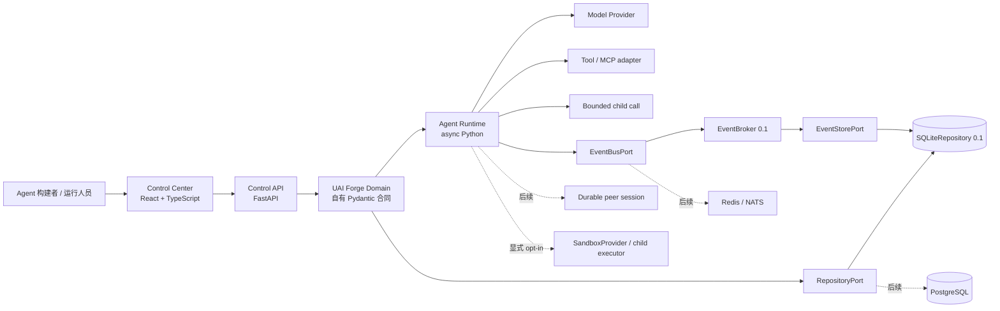
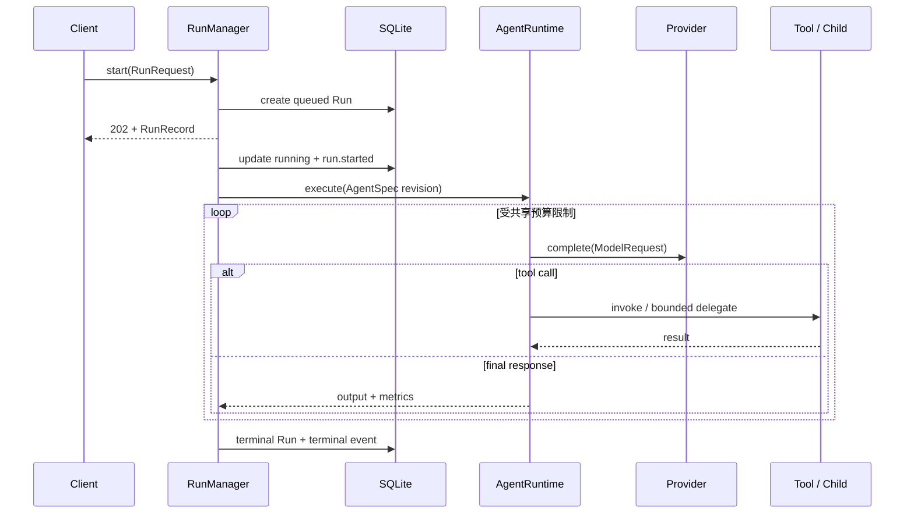
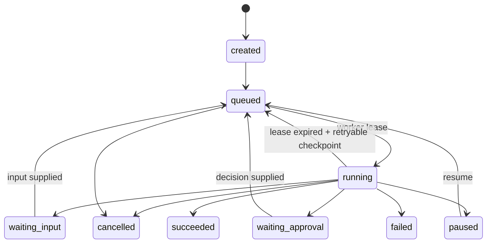

# 架构总览

## 成熟度词汇

本文和 `specs/current/foundation` 使用同一套状态，避免把设计方向写成已经交付的能力。

| 状态 | 含义 |
|---|---|
| `Implemented` | 当前代码与自动化测试共同证明该行为 |
| `Partial` | 已有部分结构或单进程行为，但尚未满足完整契约 |
| `Specified` | 规范和兼容边界已确定，仍缺实现或故障测试 |
| `Planned` | 路线方向，尚未冻结公共合同 |

UAI Forge `0.1.0` 是单进程基线。它不是分布式工作流引擎，也不承诺崩溃续跑、
exactly-once、生产级租户认证或未知插件沙箱。

## 设计目标

1. Python 运行时、Web 控制面和部署适配器共享自有领域合同。
2. Agent 定义、定义修订、会话和 Run 各自有独立生命周期；Run 直接选择 Agent revision。
3. 模型、工具、记忆、存储、消息总线、沙箱、策略和观测通过端口替换。
4. bounded nested call 和 durable peer session 是两种不同的多 Agent 语义。
5. 所有公共事件、配置和插件合同都有显式版本和兼容规则。
6. 外部副作用最终采用 checkpoint、outbox、幂等键和 fencing token 实现
   at-least-once 恢复。

## 系统上下文



Web 和 FastAPI 是适配器，不是领域模型的所有者。MCP、A2A、AG-UI、OpenAI-compatible
API 和任一开源框架都只能出现在边缘适配器中。

## 领域资源

| 概念 | `0.1.0` 表示 | 当前状态 | 目标边界 |
|---|---|---|---|
| Agent Definition | `AgentSpec.id` | `Partial` | 稳定身份，不直接承载运行状态 |
| Agent Revision | `AgentSpec.revision` 与 `agent_revisions` | `Implemented` | 不可变快照，可被 Run 和 mount 钉住 |
| Session | `RunRequest.session_id` 与 Memory key | `Partial` | 一等持久资源，保存会话状态、权限上下文和 peer inbox |
| Run | `RunRecord` | `Partial` | 一次可恢复执行，有显式状态机、lease 和取消树 |
| Invocation / Step | 仅存在于内存调用栈和事件 | `Specified` | 可持久化模型、工具、子 Agent 执行边界 |
| Checkpoint | 无 | `Specified` | 在副作用边界恢复，绑定定义修订和插件版本 |
| Agent Mount | `ChildMount` | `Partial`（bounded） | 显式声明调用语义、权限、预算和共享资源策略 |
| Team / Peer Inbox | 无 | `Specified` | 独立 Session 通过持久 inbox 和版本化消息协作 |
| Workspace | 无正式端口 | `Planned` | 本地、容器或远程沙箱；默认不隐式共享 |
| Sandbox | `SandboxProvider`、`sandbox.docker` adapter | `Partial` | 子容器 argv 执行边界已实现；rootless/dedicated executor、VM/Wasm adapter 与生产 TCK 待补 |

当前 `AgentSpec` 同时承担 Definition 最新视图和 Revision 内容。未来拆分资源时必须保持
当前 Agent ID、revision 查询和生命周期状态属于同一 v3 合同；旧数据库不在读取路径内，
必须备份后重建，不能在没有显式 schema change 的情况下重解释旧记录。

## `0.1.0` 组件

```mermaid
flowchart TB
  API["api.py"] --> Container["container.py<br/>composition root"]
  Container --> Repo["SQLiteRepository"]
  Container --> Registry["PluginRegistry"]
  Container --> Validator["AgentGraphValidator"]
  Container --> Manager["RunManager"]
  Container --> Broker["EventBroker"]
  Manager --> Runtime["AgentRuntime"]
  Runtime --> Registry
  Runtime --> RepositoryPort["RepositoryPort"]
  Runtime --> EventBusPort["EventBusPort"]
  RepositoryPort --> Repo
  EventBusPort --> Broker
  Broker --> EventStorePort["EventStorePort"]
  EventStorePort --> Repo
  Validator --> RepositoryPort
```



- `SQLiteRepository` 保存 Agent latest 指针视图、draft/published 不可变修订、Run 和有序
  Run Event；运行实例不是独立资源，旧 Instance 表不属于当前 schema。
- `PluginRegistry` 注册内置适配器并发现 `uai_forge.plugins` entry points。
- `AgentGraphValidator` 检查缺失节点、禁用节点、缺失 revision 和基本静态 mount 环；
  未固定的 mount 解析子 Agent 的 latest 标签。
  遍历使用 mount 实际钉住的 revision，并以 `(Agent ID, revision)` 区分已访问节点；旧
  revision 与 latest 拓扑相反的正反例已有回归测试。
- `RunManager` 在单进程内创建 `asyncio.Task`、限制一个 Session 同时一个 Run，并处理取消。
- `AgentRuntime` 执行模型—工具循环，bounded child 同时使用根共享账本和 invocation 本地
  账本；step/tool/token、timeout、depth 与直接 child 并发均取有效上限。mount 工具插件
  scope 沿调用树取交集，范围外或 child deny 的工具在实例化前过滤并在执行入口复验。子 Agent
  等待工具或下一层委派时转让根并发 lease，恢复执行前重新获取；三层、根并发为 1 的
  回归用例可在短超时内完成。mount semaphore 按 tenant、父 Agent revision 和 alias
  隔离，因此同 ID 跨租户不共享容量，新 revision 的并发配置也不会复用旧 semaphore。
- `EventBroker` 先写 SQLite，再向单进程订阅者扇出；SSE 可按 sequence 补播。订阅
  queue 满时只断开慢客户端，已经持久化的 publish 和 Run 不会因此失败。

`AgentRuntime`、`AgentGraphValidator` 和 `RunManager` 只依赖自有
`RepositoryPort` / `EventBusPort`；`EventBroker` 只依赖 `EventStorePort`。一个纯内存
结构化替身可在不导入 SQLite 或 EventBroker 的情况下完成真实 Run，证明执行核心没有
具体存储类型分支。当前唯一内置持久化/实时适配器仍是 `SQLiteRepository` /
`EventBroker`；尚无 PostgreSQL、Redis/NATS、CheckpointStore、OutboxStore、LeaseStore
或正式 adapter TCK，不能据此宣称具备多 worker 云端持久执行。

沙箱执行也通过自有 `SandboxProvider` 端口隔离。当前 `sandbox.docker` 只接受 argv、stdin
和可收紧的资源/超时参数，构造无网络、只读 rootfs、无 capability 的子容器命令；Docker CLI、
`runsc`、`kata-runtime`、Firecracker、Wasm 和远程 executor 都属于边缘实现。控制面不把
rootful Docker socket 或宿主挂载交给 Agent，且新 Agent 不默认挂载 `tool.sandbox_exec`。

## 当前执行语义



进程在 Run 处于 `running` 时终止，会遗留不可自动恢复的记录；重启不会重建 Task。
这是已知 `0.1.0` 边界。

## 目标 Run 状态机



该状态机为 `Specified`，尚未在 `0.1.0` 实现。实现必须满足：

- 状态转换使用 compare-and-swap 和 fencing token。
- 每个模型、工具、子 Agent 外部边界产生持久 Invocation 与 checkpoint。
- 副作用先写 intent/outbox，再由带幂等键的 dispatcher 执行。
- 恢复语义明确为 at-least-once；无法幂等的工具必须禁止自动重试或要求人工决策。
- 取消通过持久 parent/child Run 关系传播，而不是只依赖当前 Python Task。

## 两种多 Agent 协作语义

| 维度 | Bounded nested call | Durable peer session |
|---|---|---|
| 用途 | 父 Agent 把有限任务当工具调用 | 长时间、异步或跨进程协作 |
| `0.1.0` | `Implemented`（三层单槽调用链已验证） | `Specified` |
| 身份 | 父 Run 内的嵌套 invocation | 独立 Agent、Session 和 Run |
| 生命周期 | 不长于父 Run | 可在父 Run 结束后继续 |
| 预算 | 必须继承并消耗父根预算 | 自有预算，同时受 Team/租户配额 |
| 取消 | 父取消必须取消嵌套调用 | 通过持久消息和取消策略协商 |
| 通信 | 结构化参数与结构化返回值 | 版本化 inbox message |
| Workspace | 默认不创建独立共享状态 | 必须显式声明 none/read-only/copy-on-write/shared |
| 失败 | 作为一次工具调用失败返回父循环 | 独立重试、暂停、升级或 handoff |

不得把 durable peer 实现为一个运行很久的 `asyncio.gather`，也不得把 bounded child
伪装成独立 Session。

## 扩展边界

当前可执行端口包括 Model Provider、Tool、Memory 和 Middleware；执行核心还使用最小的
`RepositoryPort`、`EventStorePort`、`EventBusPort`，SSE 适配层使用
`EventStreamPort`。SQLiteRepository 与 EventBroker 通过结构化类型实现这些自有合同。
Scheduler 有接口但内置 manifest 标记不可用；Storage/Event Bus 虽已进入能力目录，但
尚未接入带配置 Schema、生命周期与 TCK 的第三方 adapter 装载流程，当前仍只有本地内置
实现。

目标端口：

- `ModelProvider`
- `ToolProvider`
- `MemoryStore`
- `RepositoryPort`（当前最小 Run/Agent 读写面）
- `EventStorePort` / `EventBusPort` / `EventStreamPort`（当前单进程面）
- `SessionStore`
- `RunStore`
- `CheckpointStore`
- `OutboxStore`
- `MessageBus`
- `WorkspaceProvider`
- `CredentialResolver`
- `PolicyEngine`
- `Tracer`

插件包只能通过版本化 manifest 声明实现、配置 Schema、核心版本范围、权限、信任级和
状态迁移。未知 in-process entry point 等同执行任意 Python，只允许管理员预安装并视为
可信代码；不可信扩展必须通过隔离进程、容器、MCP 或远程协议接入。

安全、认证、租户、权限和审批 hook 必须 fail closed。日志、指标和非关键 trace exporter
可以 fail open，但必须产生降级诊断。生命周期 middleware 不能覆盖最终权限决策。

## 事件与协议版本

`0.1.0` 的 `RunEvent` 只有 Run 内单调 sequence，适合单进程 SSE 回放，但缺少稳定事件 ID、
tenant、session、correlation、causation 和 payload schema 标识。

目标事件信封至少包含：

```text
spec_version, event_type, tenant_id, agent_id, session_id, run_id,
event_id, correlation_id, causation_id, sequence, timestamp,
payload_schema, payload
```

兼容规则：

1. 公共 HTTP、事件和插件合同使用独立版本，不与 Python 包版本隐式绑定。
2. 同一主版本只允许新增可选字段和新事件类型；消费者必须忽略未知可选字段。
3. 删除、重命名、语义变化或 required 字段新增需要新主版本和迁移说明。
4. Event payload 用 `payload_schema` 独立版本化。
5. 原始 chain-of-thought、凭据和 Secret 值禁止进入事件；只允许可审核摘要。

当前与目标 JSON Schema 位于
`specs/current/foundation/contracts/`。

## 架构不变量

- 所有持久记录和查询必须带可信来源的 `tenant_id`。
- Agent Revision 一旦被 Run 或 mount 引用就不可变。
- 子 Agent 的有效权限不得超过父权限、mount scope 和子策略的交集。
- 一个 Run 的事件 sequence 严格递增；终态之后不得再产生非诊断业务事件。
- 同一幂等键和副作用类型最多产生一个已提交外部结果。
- 插件状态只写入自己的命名空间。
- Secret 只以引用形式进入配置，解析发生在受信任适配器边界。
- 未通过 Schema、协议和权限检查的输入不能进入运行循环。
