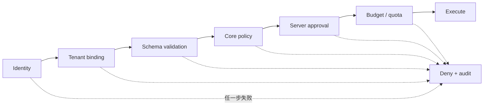

# 威胁模型

## 范围与假设

范围包括 Web 控制台、FastAPI 控制面、Python Runtime、模型/工具/插件、持久化和未来的
远程 peer。`0.1.0` 假设本地操作者和预安装 Python 插件受信任；它不适合作为互不信任
用户共享的公网多租户服务。

保护资产：

- 租户的 Agent 定义、prompt、会话、Run 和事件。
- 模型/API 凭据、工具 authority、workspace 数据。
- Agent Revision、插件版本和审计证据的完整性。
- 预算、配额、审批与取消决定。

## 信任边界

| ID | 边界 | 主要风险 |
|---|---|---|
| `TB-01` | Browser → Control API | 伪造 tenant、CSRF/CORS、令牌泄露、越权配置 |
| `TB-02` | Control API → Runtime | 未校验配置、客户端伪造批准、资源耗尽 |
| `TB-03` | Runtime → Model provider | prompt/Secret 外泄、供应商保留、恶意响应 |
| `TB-04` | Runtime → Tool | 命令执行、SSRF、数据破坏、重复副作用 |
| `TB-05` | Core → Python entry point | 任意代码执行、供应链和依赖混淆 |
| `TB-06` | Worker → Storage/Bus | 跨租户读取、事件篡改、重复投递、竞态 |
| `TB-07` | Parent → Child/Peer | 权限放大、预算逃逸、递归、共享 workspace 污染 |
| `TB-08` | Runtime → Workspace | 路径逃逸、网络外传、宿主机访问 |

## 威胁与处置

| ID | 威胁 | `0.1.0` 现状 | 必需处置 |
|---|---|---|---|
| `SEC-THR-001` | 客户端伪造 `X-Tenant-ID` | Repository 查询带 tenant，但 tenant 来自未认证 header | 公网部署前以 OIDC subject/claim 绑定 tenant；禁止调用者任意选择 |
| `SEC-THR-002` | 共享控制密钥权限过大 | 可选单一 API key，无角色 | `0.4` 引入短时令牌、RBAC/ABAC、操作级审计 |
| `SEC-THR-003` | 客户端通过 Run metadata 自报工具已批准 | 服务端丢弃客户端批准声明；尚无批准资源时 `confirm` 工具 fail closed | 批准必须是服务端签发、一次性、绑定 call hash/tenant/run/expiry 的记录 |
| `SEC-THR-004` | prompt injection 诱导高影响工具 | 有 auto/confirm/deny，但不是完整 policy engine | 工具分级、参数级 policy、提议/执行分离、输出不自动提升为指令 |
| `SEC-THR-005` | Python 插件在发现时执行任意代码 | entry point 会直接 `load()` | 仅管理员预安装可信包；导入前 manifest 检查；不可信插件隔离进程/容器/远程 |
| `SEC-THR-006` | 插件绕过安全 hook | Middleware 可修改模型/工具数据 | 认证、tenant、permission、approval 由不可覆盖的核心 PolicyEngine 决定并 fail closed |
| `SEC-THR-007` | Secret 进入配置、事件或日志 | ModelConfig 密文存储、Agent 只保存 `model_config_id`、运行时短暂解密；provider 无数据库凭据时 fail closed | Secret Manager 轮换、插件自定义敏感字段、事件完整性和全输出泄露测试 |
| `SEC-THR-008` | 模型或 MCP endpoint SSRF | OpenAI-compatible base URL 可配置；MCP 尚未实现 | endpoint allowlist、DNS/IP 重绑定防护、egress policy、代理和私网地址阻断 |
| `SEC-THR-009` | 重试导致重复外部副作用 | 无 checkpoint/outbox/idempotency | intent/outbox、幂等键、fencing；不可幂等工具禁止自动重试 |
| `SEC-THR-010` | 子 Agent 逃逸父预算或形成递归 | 有静态环、depth、共享 step/tool/token/并发限制 | 保持根预算；增加持久调用树、取消传播和租户总配额 |
| `SEC-THR-011` | 父子共享 workspace 造成越权或写冲突 | `0.1.0` 无正式 workspace | 默认 `none`；显式 read-only/copy-on-write/shared；共享写需要锁和审计 |
| `SEC-THR-012` | 事件包含敏感输出或被篡改 | SQLite 保存 payload，未完整脱敏/签名 | 事件 allowlist、摘要、完整性保护、保留期、按租户授权 |
| `SEC-THR-013` | SSE 跨租户订阅 | 查询带 tenant，但 tenant header 可伪造 | 身份绑定 tenant；Run ownership 校验；断线 cursor 不携带权限 |
| `SEC-THR-014` | 大输入、高并发或无限队列 DoS | 有长度、预算和部分 semaphore；订阅 queue 有界 | API rate limit、租户配额、queue backpressure、payload/并发上限 |
| `SEC-THR-015` | 恶意 Revision 或插件版本替换历史语义 | Agent revision 已保留；插件组合未钉住 | Run 钉住 Agent/插件/策略版本，制品签名和 SBOM，历史记录不可变 |
| `SEC-THR-016` | 原始 chain-of-thought 泄露 | 当前模型输出不专门建模 CoT | 明确禁止持久化/展示原始 CoT，仅保存简短可审核决策摘要 |
| `SEC-THR-017` | Agent 通过 Docker socket/host mount 获得宿主控制权 | 当前 sandbox adapter 不暴露 socket/mount；真实 daemon 部署尚未完成 | rootless/dedicated executor、禁止 rootful socket、镜像 allowlist/digest、宿主 egress 和 escape/故障演练 |
| `SEC-THR-018` | 沙箱命令/输出造成宿主或租户 DoS | adapter 有 CPU/memory/pids/timeout/output 边界；无租户总配额 | 父 Run budget、租户配额、队列 backpressure、容器回收和资源指标 |

## Fail-closed 决策链



插件 middleware 可以提供额外拒绝条件，不能把核心拒绝改为允许。只有观测 exporter 可在
失败后继续业务执行，并必须记录 degraded 状态。

## 子 Agent 权限

bounded child 的有效权限：

```text
effective = tenant_policy ∩ parent_grant ∩ mount_scope ∩ child_policy
```

`0.1.x` 已实现其中 bounded 插件工具的可执行子集：ancestor mount scope 与当前
`allowed_tools`（插件 ID）沿树取交集，再叠加 child ToolBinding 的 enabled/permission；
范围外与 `deny` 工具不会实例化或暴露，伪造 tool call 在核心入口再次拒绝。缺失/`null`
scope 为旧 revision 保持兼容，表示不新增限制；显式空列表拒绝全部插件工具。

tenant PolicyEngine、稳定 binding grant、Secret/workspace scope、可消费 Approval 和
durable peer 权限仍未实现，因此上式的完整身份授权语义仍是后续工作。

durable peer 不自动继承 parent 权限。Team 邀请创建的是通信关系，不是工具、Secret 或
workspace 授权。Peer message 必须有 schema、sender、recipient、correlation、expiry 和
去重键。

## 安全验证

最低自动化证据：

- 两个 tenant 使用相同资源 ID 不能互相读取。
- 未认证调用不能通过 header 切换 tenant。
- confirm 工具不能通过 request metadata 自我批准。
- 插件协议、权限或迁移不兼容时拒绝启用。
- Secret 样本不出现在 Event、日志、异常、API 响应或 HTML。
- 重放相同副作用 intent 不重复调用外部系统。
- 父取消传播到所有 bounded child；durable peer 按策略收到取消消息。
- 恶意 URL、路径穿越、超大 payload 和递归挂载被拒绝。

## 已接受风险

`0.1.0` 只接受受信任本地开发环境中的以下风险：

- 未配置 API key 时无身份认证。
- `X-Tenant-ID` 只是数据分区参数，不是可信租户身份。
- entry-point 插件与宿主进程等权。
- 运行中进程崩溃不能续跑。

任一风险在公网、多用户或高影响工具环境中都不可接受。
