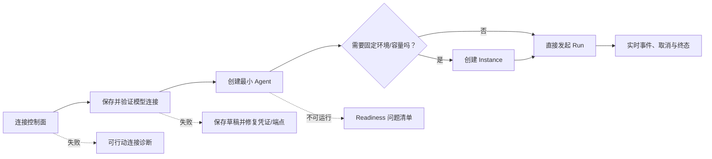

# UAI Forge 产品化与易用性优化审计

## 结论

最近两组改动表达的产品方向是明确且正确的：UAI Forge 不再把演示数据、伪造 Provider、
默认团队或托管平台 workflow 当作产品能力；模型连接改为租户级统一 `ModelConfig`，真实
Provider 通过协议适配器接入，Agent 只保存配置引用。

当前最主要的问题不是缺少更多功能，而是**后端已经从 demo 走向真实控制面，前端的用户
旅程、状态文案、升级策略和验证证据还没有同步完成产品化**。这造成四类直接风险：

1. 空数据库仍出现“运行研究团队”“READY”“全部生效”等演示语义，和真实状态冲突。
2. “模型连接 → Agent → 可选 Instance → Run”的前置关系没有被组织成可完成的首用流程。
3. 已有 SSE、版本化修订和数据库事实源没有完整投射到前端；长 Run 仍靠短轮询，配置更新
   缺少并发保护。
4. 规范、发布说明和测试证据存在新旧口径并存，容易让后续开发继续沿错误事实实现。

因此下一阶段应以“真实状态、可恢复操作、明确前置条件、可验证用户旅程”为主线，而不是
继续向单一大页面叠加控件。

## 审计依据

本次只做了读取、运行验证和文档设计，没有修改业务代码或数据库业务数据。

- 规范：项目宪章、Foundation current spec、ADR-0001—0007、全局追踪矩阵。
- 最近变更：CHG-0008（移除产品 Mock/seed/workflow）与 CHG-0009（统一 ModelConfig、
  Anthropic Messages、模型目录）。
- 实现：FastAPI、SQLite repository、Provider adapters、RunManager、React 控制台及测试。
- 页面：独立临时空数据库，桌面宽度和 `390 × 844` 窄屏下检查总览、系统设置、统一模型
  配置、新建 Agent、发起 Run 五个关键状态。
- 门禁：后端 `73 passed`；前端 lint、typecheck、production build 和 4 项 SSR/source 测试
  全部通过。

门禁通过证明当前合同和构建基线没有明显回归，但前端 4 项测试主要是 SSR 与源码字符串
断言，不能证明首用流程、键盘操作、错误恢复、SSE 续播或窄屏可用性。

## 已做对的部分

- 移除生产 Mock、seed 和离线伪造运行，避免空库被误认为真实业务数据。
- `ModelConfig` 将 provider、protocol、model、endpoint 和加密凭证收敛成一个用户心智对象。
- Agent 只引用 `model_config_id`，没有把 Provider SDK 或 Secret 泄漏进核心合同。
- OpenAI-compatible 与 Anthropic Messages 均在边界做协议映射，核心仍使用自有消息模型。
- 空库和断线不再生成本地 Agent/Run fallback；控制面配置失败时保持 fail closed。
- Agent 修订、挂载图、根预算、事件顺序和插件 Schema 已有较扎实的后端测试证据。

这些能力应保留，优化重点是让控制台和运维流程诚实地表达它们。

## 关键用户流程审计

| 步骤 | 用户目标 | 当前表现 | 健康度 |
|---|---|---|---|
| 1. 连接控制面 | 确认正在操作哪个 Runtime | 可配置 API 地址，控制密钥只在内存；但硬编码显示 `Workspace Admin / default tenant` | 有风险 |
| 2. 空库总览 | 知道第一步该做什么 | 主按钮仍是“运行研究团队”，拓扑显示 `READY`，运行保护显示“全部生效” | 阻塞 |
| 3. 创建模型连接 | 配置真实 Provider 并确认可用 | 统一表单明显优于旧双资源；但没有保存草稿/测试连接/验证后启用的生命周期 | 有风险 |
| 4. 创建 Agent | 完成最小可运行定义 | 无模型配置时仍打开超长高级表单，提交按钮禁用但没有修复入口；基础与高级配置混在一个模态框 | 阻塞 |
| 5. 创建 Instance | 理解 Instance 是否必需 | 页面说明 environment 只是标签是正确的；但首用路径没有说明 Instance 可选、直接 Agent Run 与 Instance Run 的区别 | 有风险 |
| 6. 发起与观察 Run | 选择可运行目标并持续看到事件 | 无目标时下拉框为空且没有引导；创建后最多轮询约 15 秒，没有消费已有 SSE 续播合同 | 阻塞 |

## 问题清单与优先级

### P0：先修复事实和闭环

#### A-001 — 空库仍展示演示时代的“可运行”状态

证据：`Overview` 无条件渲染“运行研究团队”“研究团队运行图”“READY”“全部生效”，
并使用固定的 4 层、4 并发、120 秒；这些值不来自任何可运行 Agent 或服务器能力状态。

影响：违反“证据优于自报”和“不虚假承诺”；用户会在没有 ModelConfig、Agent 或 Instance
时点击必然失败的动作。

方案：总览必须由真实 Setup/Readiness 状态驱动。空库只展示首用清单和一个当前可完成的
主操作；能力状态由服务器返回，未知或部分实现不得显示为“全部生效”。

#### A-002 — 首用依赖关系没有产品化

证据：新建 Agent 和发起 Run 按钮始终可打开；缺少前置资源时只有空下拉框或 disabled
按钮，没有原因、修复动作和返回上下文。

影响：用户可以进入死路，但不知道应该先创建模型连接还是 Instance。

方案：建立计算型 SetupStatus：连接控制面 → 验证模型连接 → 创建 Agent → 可选创建
Instance → 发起 Run。所有跨页面动作使用统一 `PrerequisiteGate`，给出原因和一键修复入口。

#### A-003 — CHG-0009 的破坏性升级缺少运行时兼容门

证据：SQLite 仍使用 `CREATE TABLE IF NOT EXISTS`，没有 schema version；CHG-0009 明确不迁移
旧 CredentialProfile/ModelProfile 和旧 Agent JSON。旧数据库可能在读取时才以 500/Pydantic
错误暴露不兼容。

影响：升级失败不可预测，用户不知道需要备份、重建配置还是使用新数据库。

方案：不违背 ADR-0007 的“不自动迁移旧配置”决定；增加 `schema_meta`、启动/doctor
兼容检查、只读诊断和明确的备份/重建指引。未来变化必须进入版本化迁移框架。

#### A-004 — 当前规范和发布证据存在新旧口径漂移

已确认的例子：

- current requirements/deployment 仍声称 fresh registry 只有 `openai_compatible`，实际 smoke
  已要求 `anthropic_messages` 与 `openai_compatible`。
- README 仍使用“多凭据、多模型配置档”“唯一 provider 注册”等旧措辞。
- CHG-0008 的历史设计仍引用 ModelProfile/CredentialProfile，未明确已被 CHG-0009 后续
  变更替代。
- UI-001 追踪仍引用过去的浏览器 17 事件证据，但当前产品已删除依赖伪造 Provider 的该
  路径。

影响：规范驱动开发会把过期文字当成新的实现依据。

方案：在实现 CHG-0010 前完成一次 current-spec reconciliation；历史 change 文档保留事实，
通过 `superseded_by`/勘误说明连接后续变更，不伪造历史。

#### A-005 — Run 页面没有兑现后端 SSE 能力

证据：提交 Run 后前端每 500ms 轮询一次、最多 30 次；源码没有 `EventSource` 或等价 SSE
客户端。长于约 15 秒的 Run 会停止自动更新，history 也不是持续订阅。

影响：用户误以为 Run 卡死；事件、取消和终态展示可能落后。

方案：以 `/runs/{id}/events` + sequence cursor 为主通道，断线按最后 sequence 续播；Run
状态查询只做校准和 SSE 不可用时的有界降级。

### P1：建立可靠操作语义

#### A-006 — ModelConfig 缺少并发、验证和 Secret 生命周期

- ModelConfig 没有 `version/expected_version`，多个页面编辑会 last-write-wins。
- 创建即默认启用，但没有真实 Provider preflight。
- PATCH 中 `secret = null` 表示沿用，缺少显式 clear；切换到无凭证 Provider 可能保留不再
  需要的密文。
- 删除保护扫描全部 Agent revision JSON，能保证引用但缺少可解释的引用清单。

方案：ModelConfig 增加版本和 CAS；采用 `draft → verified → enabled/disabled/error` 操作
语义；Secret 使用 `keep/replace/clear` 显式动作；验证结果只保存脱敏 code、时间、延迟和
目标摘要。

#### A-007 — 前端加载是全有或全无，错误不可行动

六个资源请求放在一个 `Promise.all` 中，任一接口失败就清空全部集合；业务请求直接把
`response.text()` 暴露给用户。短暂的 runtime-config 错误也会让 Agent、Run 和模型连接
一起消失。

方案：按资源维护 `idle/loading/ready/stale/error`；同一连接的瞬时失败保留最后成功数据并
标记 stale，身份/tenant/API base 改变时先清空；服务端采用稳定 Problem Details 合同，前端
提供字段级错误和修复动作。

#### A-008 — 身份和租户状态具有误导性

控制台无认证上下文时固定显示 `Workspace Admin`，同时固定发送 `X-Tenant-ID: default`。
这会把客户端自报分区误表示为可信角色和租户身份。

方案：0.1.x 显示“本地操作者 / 未认证控制面 / default 数据分区”，不显示 Admin；未来
OIDC 后才从服务端身份声明渲染角色与 tenant。

#### A-009 — Provider UI 仍有硬编码扩展盲区

Provider manifest 已提供 protocol 和 model catalog，但 endpoint 快捷项、timeout、token、
temperature 及部分 Provider 文案仍固化在控制台。第三方 Provider 可以注册，却不能完整
驱动相同质量的表单。

方案：先扩展自有 manifest 的 connection/config UI hints 与连接检查 capability，再实现
Schema 驱动字段；未知字段继续保留高级 JSON，但不能成为普通配置的主要入口。

#### A-010 — 控制台结构与测试不足以支撑继续增长

`app/control-center.tsx` 接近 4,000 行，`globals.css` 超过 3,700 行且存在旧暗色规则与新亮色
覆盖叠层。当前前端测试不执行真实点击、错误、SSE、焦点或响应式流程。

方案：按 `connection/model-configs/agents/instances/runs/system` 拆 feature；建立类型化 API
client、资源状态层、SSE projection 和共享表单/错误组件；新增组件与浏览器流程测试。

#### A-011 — 可访问性与窄屏只是“能缩放”，尚未达到可操作

证据：大量辅助文字使用 7—10px；全局 `focus-visible` 只显式覆盖 button/link；长 Agent
模态框没有已验证的焦点圈闭、Escape 和关闭后焦点恢复；390px 下模型配置表单信息密集，
关键操作需要很长滚动。

方案：正文最小 14px、辅助文字最小 12px；所有交互控件有一致 focus-visible；模态框实现
焦点圈闭、Escape、初始焦点和恢复；基础/高级字段分层，完成 390px、200% zoom 和键盘 E2E。

#### A-012 — 页面状态不可深链和恢复

导航和详情完全由组件 `useState` 控制，刷新、浏览器前进后退或分享 URL 都无法恢复到特定
Agent/Run/配置。

方案：将主视图与资源详情映射到 URL；短期可使用受控 query state，目标采用明确的资源路由。

#### A-013 — 自定义 Provider endpoint 缺少前置安全分级

`base_url` 是自由字符串，威胁模型已记录 SSRF，但 UI 没有来源/内网提示，服务端也没有
URL scheme/host 规范化和策略接口。

方案：0.2 先做 URL 合同、HTTPS 默认、危险 scheme 拒绝、回环/私网策略提示；公网或多租户
部署前必须增加 DNS/IP 重绑定防护和 egress policy。连接检查不得回显响应 body 或 Secret。

### P2：降低认知成本和长期维护成本

- 把 `Agent Definition / Revision / Instance / Run` 在首次出现时翻译成用户任务语言，并保留
  技术名作为次级说明。
- “Instance 可选”应在首用流程中明确；environment 始终称“运行上下文标签”，不能用 cloud
  数量暗示已部署云资源。
- 模型目录显示来源、目录更新时间、推荐/legacy 状态和“静态目录，不是在线发现”。
- 系统设置拆成“连接”“运行配置”“安全与能力”“部署信息”，默认只显示可操作项。
- 删除、停用、Secret 轮换、revision 发布等高影响动作采用应用内确认，不依赖浏览器原生
  `window.confirm`。
- 增加空列表的解释、示例命名和下一步，而不是只显示“暂无”。

## 目标用户旅程

## 建议实施顺序

| Wave | 目标 | 主要交付 | 退出条件 |
|---|---|---|---|
| A | 事实一致与首用不走死路 | current spec reconciliation、SetupStatus、前置门、真实空状态、身份文案 | 空库每一步只有可完成的主操作 |
| B | 配置可验证可并发 | ModelConfig version/CAS、draft/preflight/enable、Secret action、引用诊断 | 两个编辑者不会静默覆盖；失败连接不能伪装 ready |
| C | Run 实时且错误可恢复 | SSE projection、cursor 续播、Problem Details、资源级 stale/error | 长 Run 和断线重连保持连续事件与终态 |
| D | 控制台可持续演进 | feature 拆分、URL 状态、分步 Agent 表单、可访问性和窄屏 | 核心流程键盘/390px/200% zoom 通过 |
| E | 发布与升级可信 | schema compatibility gate、doctor、`make verify` 证据清单 | 不兼容数据库在写入前被明确拒绝并给出恢复指引 |

详细合同、数据结构、API、前端边界和测试计划见
[`specs/changes/CHG-0010-control-center-productization-and-operability/design.md`](../../specs/changes/CHG-0010-control-center-productization-and-operability/design.md)。

## 成功指标

- 全新空库用户无需文档猜测即可完成首个真实 Run，流程中没有空下拉框或无解释 disabled。
- UI 中所有 `ready/enforced/admin/cloud` 状态都有服务器证据或明确标为局部/规划。
- 同一 ModelConfig 的并发更新返回确定性 409，不发生静默覆盖。
- 长 Run 在事件产生后 2 秒内更新；断线后从最后 sequence 续播且不丢终态。
- 390px 宽度与 200% zoom 下无信息丢失；核心流程仅键盘可完成。
- 前端测试覆盖首用、错误恢复、SSE、焦点和窄屏，而不只检查源码是否含某段文字。
- Secret 样本不出现在 API 响应、Problem Details、事件、日志、HTML 或测试快照。
- 不兼容数据库在启动写入前被 doctor/compatibility gate 识别，并给出备份和重建路径。

## 本次不做

本审计不把 0.1.x 扩大为分布式系统，也不实现 OIDC/RBAC、插件沙箱、durable peer、
checkpoint/outbox/lease 或生产级多租户。它只为后续改造冻结用户旅程、边界和验收方式。
