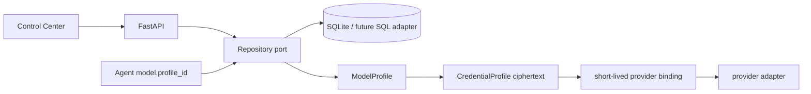

# Design

## Data flow

业务表包括 `credential_profiles`、`model_profiles` 和 `runtime_configs`。凭据的密文和
mask 存库，master key 只来自启动 bootstrap；`ModelBinding._runtime_credential` 是私有
运行属性，Pydantic dump 不会包含它。

## Migration boundary

`api_key_env` 和 provider 环境变量取 AK 路径不再支持。非 mock Agent 必须在运行前绑定
数据库 ModelProfile；ModelProfile 再引用启用的 CredentialProfile。迁移脚本/未来 SQL
适配器必须实现相同的仓储方法和脱敏响应合同。
