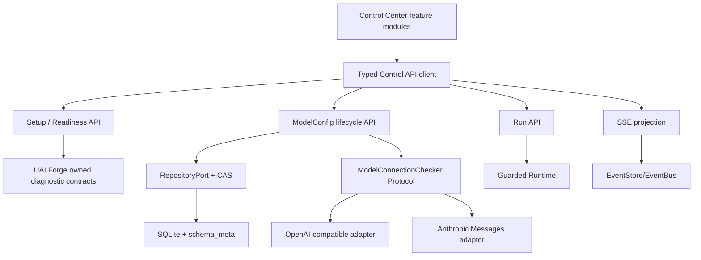

# 控制台产品化与可运维操作开发设计

## 1. 约束

- 核心继续只使用 UAI Forge 自有合同；Provider HTTP/SDK 类型留在 adapter。
- 单进程 0.1.x/0.2 基线不宣称分布式恢复、生产级租户认证或插件沙箱。
- Secret 只在一次性写入和 Provider adapter 调用边界出现，不进入诊断、事件、日志或 UI
  持久化。
- ADR-0007 的旧配置“不自动迁移”保持有效；本设计增加兼容检测和恢复指引，不静默改写。
- 新的 Provider connection check 是扩展点：先改 manifest/Protocol/TCK，再改内置适配器。

## 2. 目标结构



Setup/Readiness 是计算视图，不成为第二个配置事实源。ModelConfig、Agent revision、Instance、
Run 和 Event 仍由现有 repository 保存。

## 3. 自有合同

### 3.1 SetupStatus

```text
SetupStatus
  connection: connected | unauthorized | incompatible | unavailable
  model_connections: {total, verified_enabled, blocking_issues[]}
  agents: {total, runnable, blocking_issues[]}
  instances: {total, ready}
  runs: {total, active, last_terminal_at?}
  next_action: connect | create_model_config | verify_model_config |
               create_agent | run_agent | none
```

`next_action` 只用于引导，不替代各资源写入校验。前端不能自行把资源数量推断成 ready。

### 3.2 CapabilityStatus

```text
CapabilityStatus
  id
  state: implemented | partial | planned | unavailable
  summary
  limits[]
  evidence_refs[]
```

`GET /system` 可兼容保留现有 `features`，新增版本化 capability 列表。控制台不得硬编码
“全部生效”。

### 3.3 ReadinessIssue

```text
ReadinessIssue
  code
  resource_type
  resource_id
  path?
  message
  remediation: {action, target}
```

首批 code：`model_config.missing`、`model_config.disabled`、`model_config.unverified`、
`model_config.secret_unavailable`、`provider.unavailable`、`plugin.config_invalid`、
`agent.disabled`、`agent.topology_invalid`、`instance.not_ready`、`schema.incompatible`。

### 3.4 ModelConfig v2 additive fields

```text
version: integer >= 1
lifecycle: draft | verified | enabled | disabled | error
verification:
  status: never | passed | failed
  checked_at?
  code?
  latency_ms?
  endpoint_summary?
```

`enabled` 旧字段在兼容窗口内可由 lifecycle 派生；迁移完成后只保留一个事实源。不能让
`enabled=true` 与 `lifecycle=error` 同时被解释为可运行。

写入命令增加：

```text
expected_version
secret_action: keep | replace | clear
secret?: one-time plaintext; only legal with replace
```

Provider 切换默认把状态降为 draft，并要求重新检查；切换到无需凭证的 Provider 时 UI 默认
建议 clear，但服务端仍要求显式动作。

### 3.5 Problem Details

HTTP 保留合适的 4xx/5xx 状态，body 使用自有版本：

```json
{
  "type": "uai-forge.problem/1.0",
  "code": "model_config.version_conflict",
  "message": "模型连接已被其他操作更新",
  "field_errors": [],
  "resource": {"type": "model_config", "id": "cfg_..."},
  "retryable": true,
  "remediation": {"action": "reload_and_compare"},
  "correlation_id": "cor_..."
}
```

异常映射器只能读取 allowlist 字段。Provider error、Pydantic input、tool output 和堆栈不得
直接拼接进 body。

## 4. API 设计

| 方法 | 路径 | 语义 |
|---|---|---|
| GET | `/api/v1/setup-status` | 当前 tenant 的计算型首用/阻塞状态 |
| GET | `/api/v1/capabilities` | 能力成熟度与限制；也可作为 `/system` 的 additive 字段 |
| GET | `/api/v1/agents/{id}/readiness?revision=` | 模型、插件、拓扑和 enabled 诊断 |
| POST | `/api/v1/model-configs/{id}/checks` | 显式连接检查；不自动写业务状态以外的数据 |
| PATCH | `/api/v1/model-configs/{id}` | 要求 `expected_version` 和显式 Secret action |
| GET | `/api/v1/model-configs/{id}/references` | 返回引用 Agent revision 摘要 |
| GET | `/api/v1/runs/{id}/events` | 复用现有 SSE；客户端携带 cursor 续播 |

连接检查不使用真实用户 prompt。每个 adapter 实现最小、低成本、可取消的检查；若 Provider
没有安全的在线检查，则只做本地配置检查并返回 `partial`，不得伪装远端已验证。

### 4.1 Provider manifest/Protocol delta

Manifest additive 字段：

```text
connection_check: none | local | remote
connection_schema_version
ui_hints: endpoint presets, common numeric fields, secret label
catalog_version / catalog_updated_at
```

核心定义 `ModelConnectionChecker.check(ConnectionCheckRequest) -> ConnectionCheckResult`。
adapter TCK 验证 timeout、取消、凭证缺失、网络错误、脱敏和未知响应。第三方 adapter 不实现
该 capability 时仍可保存 draft，但 UI 明确显示“未提供在线验证”。

## 5. 数据与事务

### 5.1 schema compatibility gate

新增单行 `schema_meta(component, version, updated_at)`。启动顺序：

1. 只读检查数据库存在性、schema_meta 和 legacy 表/列。
2. 新数据库写入当前 schema version 后建表。
3. 已知可迁移版本执行显式 migration transaction。
4. ADR-0007 之前且包含 legacy CredentialProfile/ModelProfile 的数据库返回
   `schema.legacy_model_configuration`，不自动转换。
5. 未知更高版本拒绝启动写路径，doctor 仍可输出只读诊断。

不得用 `CREATE TABLE IF NOT EXISTS` 的成功替代 schema 兼容证明。

### 5.2 ModelConfig CAS

更新 SQL 必须包含 `WHERE tenant_id=? AND id=? AND version=?`，rowcount 为 0 时区分 not found
与 version conflict。Secret 密文、配置、verification 和 version 在同一事务更新。

连接检查的网络调用不持有数据库事务：读取 version → 外部检查 → 以相同 expected_version
提交验证摘要；版本已变化则丢弃结果并返回冲突。

### 5.3 引用诊断

0.2 可先保留扫描 revision JSON 的实现，但 repository 端口返回分页摘要并记录耗时；当数据量
超过阈值后再引入规范化引用索引。删除保护仍覆盖历史 revision。

## 6. 前端信息架构与流程

### 6.1 空库总览

空库不渲染虚构拓扑和固定保护数值，改为：

- 控制面状态和真实数据源说明。
- 4 步 Setup checklist；当前一步展开，已完成步骤可复查。
- 单一主按钮，例如“创建模型连接”。
- “为什么需要它”与 Secret 边界的短说明。

存在真实 Agent/Run 后才切换为运营总览；拓扑的 READY 来自 Readiness API。

### 6.2 模型连接

列表页默认展示状态、Provider/model、脱敏凭证、最后验证和引用数量。新建使用三段：

1. Provider、model、endpoint。
2. Secret 与非敏感参数。
3. 保存草稿 → 测试连接 → 启用。

验证失败时保留草稿和表单输入（Secret 除外），显示 code、字段和修复建议。编辑现有连接
必须带 version；冲突时提供“重新加载并比较”，不静默覆盖。

### 6.3 Agent

新建流程分为：

1. 基础：名称、职责、ModelConfig、system prompt。
2. 能力：工具、memory、middleware、children。
3. 策略：预算、并发、timeout。
4. Review：Readiness、将创建的 revision 和关键风险。

没有可用 ModelConfig 时不打开空表单，直接展示前置说明和“创建模型连接”；高级 JSON 仅在
相应插件 manifest 无结构化控件时出现。

### 6.4 Instance

文案明确：直接运行 Agent 使用 latest revision；Instance 用于钉住 revision、环境标签和
容量。environment 只显示为上下文标签。创建后容量修改在后端语义未完成前必须提示“新 Run
生效/需重启”或禁用，不能暗示 semaphore 已热更新。

### 6.5 Run

无可运行目标时显示 Readiness 问题列表和修复链接，不渲染空 select。active Run 进入事件
视图后：

- 先取 history 与最后 sequence。
- 注册 SSE，从 cursor 续播。
- reducer 按 sequence 去重并投射 Run 状态。
- 断线显示 reconnecting，不清空历史。
- SSE 连续失败后启用有界 polling，并标记 degraded。
- cancel 只在服务器确认或事件到达后更新终态。

## 7. 前端工程边界

建议从单文件逐步拆成：

```text
app/control-center/
  api/client.ts
  api/problem-details.ts
  state/resource-state.ts
  features/connection/
  features/setup/
  features/model-configs/
  features/agents/
  features/instances/
  features/runs/
  features/system/
  components/prerequisite-gate.tsx
  components/readiness-list.tsx
  components/dialog.tsx
```

拆分只改变 Web adapter，不创建第二套领域模型。API DTO 可由 OpenAPI 生成或用薄类型映射，
禁止在组件中散落 `fetch + response.text()`。

资源状态：

```text
idle | loading | ready(data) | stale(data, problem) | error(problem)
```

同 API base + 同 tenant 的瞬时错误可以 stale；base、认证或 tenant 改变时先清空所有旧数据。

## 8. URL、焦点与响应式

- 主视图、Agent/Run/ModelConfig 详情进入可恢复 URL；modal 的 URL/历史行为保持一致。
- 共享 Dialog 组件负责 aria-labelledby、初始焦点、Tab 圈闭、Escape 和焦点恢复。
- 交互控件统一 `:focus-visible`；错误用 `aria-describedby`，提交级错误使用 `role=alert`，异步
  状态使用节制的 `aria-live`。
- 默认正文至少 14px，辅助文字至少 12px；命中区域至少 40×40 CSS px。
- 390px 下表单单列，页面标题允许换行，固定操作条不遮挡内容；200% zoom 无横向信息丢失。
- 尊重 `prefers-reduced-motion`，连接/事件状态变化不能只靠颜色。

## 9. 安全

- 无认证时显示“本地操作者/未认证”，不显示 Admin/RBAC 暗示。
- API base 可持久化，但切换后必须清空旧资源；控制密钥仍只在内存。
- endpoint 至少验证 `http/https`、规范化 host，并按部署策略拒绝危险 scheme、回环、链路本地
  和私网地址；本地开发例外必须显式标记。
- connection check 使用严格 timeout/cancel、响应大小上限和 egress policy；事件与 Problem
  Details 只保留脱敏摘要。
- 模型目录来源 URL 仅用于展示，不能被运行时当作可信动态配置。

## 10. 发布门禁

保持平台无关，新增聚合命令 `make verify`，至少串联：backend tests、lint、typecheck、前端
交互/SSR 测试、schema compatibility tests 和 shell/compose config。容器 smoke 仍单独运行，
输出机器可读 evidence summary；不重新引入特定平台 workflow 作为规范依赖。

## 11. 回滚与兼容

- API 新字段优先 additive；进入强制 CAS 前提供一个短兼容窗口并记录 deprecated 请求。
- SSE endpoint 不变，前端切换失败可回滚到明确标记 degraded 的 polling。
- Setup/Readiness 是计算 API，可独立关闭而不改变业务数据。
- schema_meta 一旦写入不可通过降级二进制忽略；回滚前必须检查兼容版本并使用备份。
- 不提供旧 CredentialProfile/ModelProfile 的自动回滚或自动迁移。
