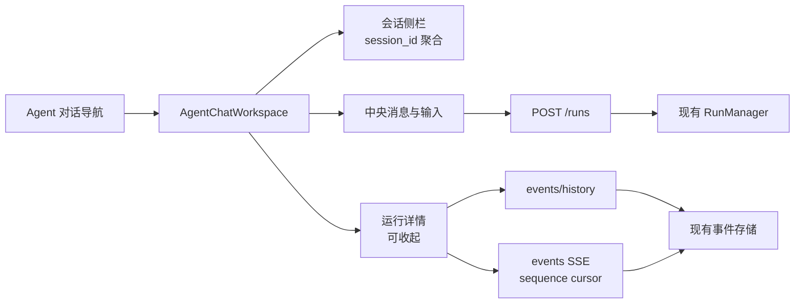

# Agent 对话工作区设计

## 1. 信息架构



全局控制台导航仍保留资源管理页面；“Agent 对话”是新增的工作区入口。工作区内部左侧侧栏只
负责会话和 Agent 选择，不复制全局资源导航。

## 2. 数据模型与边界

```text
ChatSessionProjection
  session_id: string       # 现有 RunRequest/RunRecord 字段
  runs: RunRecord[]        # 从 GET /runs 聚合的客户端投影
  latest_run_id: string?

ChatRunProjection
  run: RunRecord
  events: RunEvent[]       # mergeRunEvents + SSE cursor
  stream_status: idle | loading | live | reconnecting | degraded | complete
```

客户端生成的会话 ID 仅用于下一次 Run 的 `session_id`，不写入浏览器持久存储；已有会话由服务端
返回的 Run 列表恢复。任意 Secret 继续只通过内存中的 headers 发送到现有 API。

## 3. 交互状态

- 空状态：说明 Agent 对话来自真实控制面，并提供“新建对话”和“先配置 Agent”路径。
- 运行中：用户消息立即入流；助手卡片显示“正在运行”，运行详情显示连接状态和最新事件。
- 成功：显示 `run.output`，保留“查看运行详情”和事件条目。
- 失败：显示可读错误和 Run ID，提供“重试”按钮；重试创建新 Run，不覆盖旧 Run。
- 取消：只在服务器返回 `cancelled` 或 `run.cancelled` 后显示已取消。
- 事件断线：提示重连/降级校准，并保留已确认的事件；不清空对话。

## 4. 中文化规则

展示层维护有限的内置文案映射，例如 `tool.calculator` → “安全计算器”、
`memory.in_process` → “进程内记忆”、`middleware.audit_tags` → “审计标签”。未知扩展
回退到 manifest `display_name`，并把其 ID 作为次级代码文本；不修改服务端 manifest ID。
